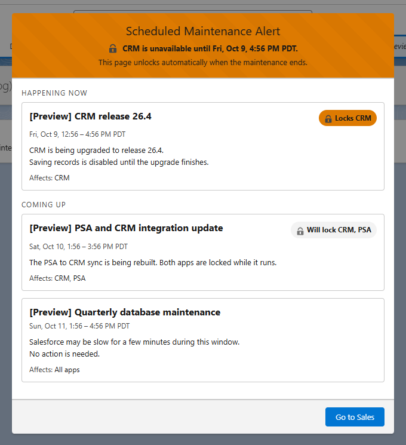
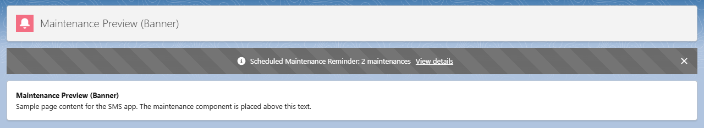
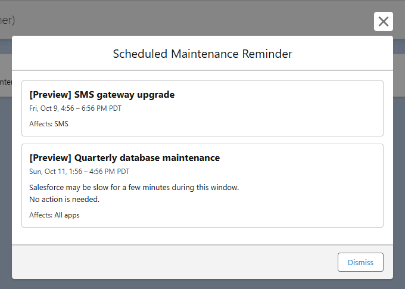
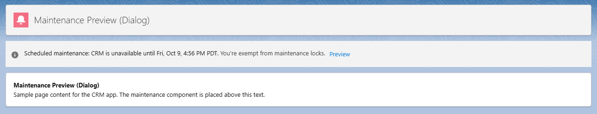
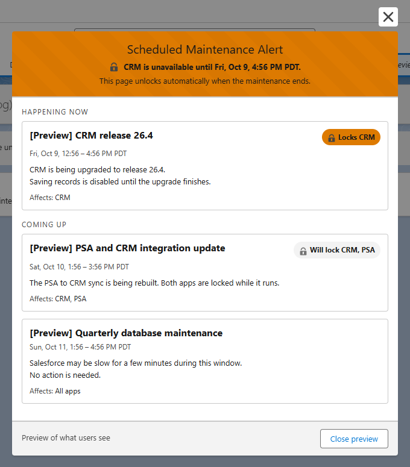

# Scheduled Maintenance Component

## Overview

The `ScheduledMaintenanceComponent` is a Salesforce Lightning Web Component (LWC) designed to manage and display scheduled maintenance alerts within a Salesforce ORG. It leverages the `Scheduled_Maintenance__c` object to retrieve and display relevant maintenance records based on their field values directly to the use on page view.

Key features include: 
- Visual updates of maintenance/release information at specified times and intervals.
- Ensuring users remain informed without needing to refresh the page with auto data refresh. 
- Blocking apps or the system from usage during maintenance time frames

> Blocking users from access can be achieved as long as the component is placed on the appropriate Lightning pages and experience sites. The app context can be defined on the component located on the Lightning page, by picking one of the `Applicable Apps` values. The targeted maintenance alert can be adjusted in the maintenance record based on the values of the multi-select picklist called `Applicable Apps`. The lock is a user-experience control, not access control; see [Limitations](#limitations).

> All components by default have a app context of "System" so any scheduled maintenance records with "system" in the Applicable Apps field will show on every component.

The component enhances user experience by providing timely alerts and essential information about maintenance activities, ensuring users are informed about potential disruptions. This can be done before the actual maintenance time if you want using the `Alert Buffer` (days) and `Alert Buffer Hours` fields.

## Features

- **Real-time Data Fetching**: Fetches scheduled maintenance data immediately upon initial load.
- **Interval-based Data Refresh**: 
  - Refreshes data every 5 minutes for the first 30 minutes.
  - After the first 30 minutes, refreshes data every 30 minutes indefinitely.
  - Refreshes again when the user returns to the tab.
  - Between refreshes, alerts and locks still start and end on time: maintenances starting within the next 35 minutes are loaded ahead, and the component re-checks at each alert, start and end time.
- **Maintenance Alerts**:
  - Displays maintenance alerts in a dialog. With the `Alert Style` property set to `Banner`, alerts that can be dismissed show as a banner in the component's place on the page instead, with a link to the details. Locks always use the dialog.
  - Alerts are shown based on the maintenance schedule and user interaction history.
- **Dismissible Alerts**: Allows users to dismiss alerts, with the option to not allow dismiss during the maintenance time frame.
- **Alert Frequency**: Controls when a dismissed alert is shown again, using browser cache data:
  - **Every Visit**: on the next page load. It stays closed during background refreshes.
  - **Daily**: on the next calendar day in the user's Salesforce time zone.
  - **Weekly**: 7 days after it was dismissed.
- **Record Specific Cache**: Uses local storage to independently track dismissals per maintenance record, ensuring each alert's frequency is evaluated separately. Dismissals are stored per Salesforce user, so on a shared computer one user's dismissals don't hide alerts from the next, and entries older than 30 days are removed.
- **System and Application Maintenance**:
  - Differentiates between system-wide maintenance and application-specific maintenance.
  - Provides visual cues (e.g., badges) for alerts requiring system or app lock.
- **User Navigation**: When an app is locked, offers a button to navigate to another app, set with the `Exit App Developer Name` property (defaults to `Welcome`). The button is hidden if that app isn't found, and on Experience Cloud sites.
- **Adaptive Titles**: Updates the title of the modal based on the current maintenance status.
- **Locale-aware Date/Time Display**: Maintenance start and end times are formatted to the user's local date and time, using their Salesforce-configured locale and timezone.
- **Applicable Apps Badges**: Each maintenance alert displays the applicable apps as visual badges for clearer context about which systems or applications are affected.
- **Admin View**: Users with the `Bypass Scheduled Maintenance` custom permission, or the `System Administrator` profile, see a one-line status instead of the maintenance alerts (for example, which app is locked and until when) and are never locked. Its **Preview** button opens the dialog users see, without locking anything or recording a dismissal. The status line also makes the component easy to find while editing Lightning pages. Assign the `Scheduled Maintenance Bypass` permission set to anyone else who should bypass the lock, such as admins on cloned profiles.

## Installation

Install the unmanaged package, version **2.0.0**:

- Production or Developer Edition: https://login.salesforce.com/packaging/installPackage.apexp?p0=04tbm000000nTfBAAU
- Sandbox: https://test.salesforce.com/packaging/installPackage.apexp?p0=04tbm000000nTfBAAU
- Or with the Salesforce CLI: `sf package install --package 04tbm000000nTfBAAU --target-org <your org> --wait 20`

Choose **Install for Admins Only**; access for everyone else comes from the permission sets.

After installing:

1. Assign the permission sets described under [Permissions](#permissions).
2. Set the **Applicable Apps** values to the apps in your org: Setup > Object Manager > Scheduled Maintenance > Fields & Relationships > Applicable Apps. Keep `System`, which applies to every app.
3. Add the component to the Lightning pages to cover in Lightning App Builder, and set its **Current App Context** (and optionally **Alert Style**, the titles and the **Exit App Developer Name**).
4. Add the **Scheduled Maintenance** tab to an app for the people who create maintenance records.
5. Optional: set up a server-side lock with **Maintenance Mode** (see [Limitations](#limitations)).

> Unmanaged packages can't be upgraded: the installed components become ordinary metadata in your org, and installing a newer version over them fails because they already exist. To update an org, deploy the newer source from this repo instead (`sf project deploy start --source-dir force-app`). Uninstalling the package deletes the component, the object and all maintenance records.

## Permissions

The component reads maintenance records with the user's own object and field permissions, so assign permission sets as follows:

- **Object - Scheduled Maintenance - Level 1**: read access. Required for every user who sees the component. Without it the component can't load maintenances, and no alert or lock is shown.
- **Object - Scheduled Maintenance - Level 6**: full access, for people who create and edit maintenance records.
- **Scheduled Maintenance Bypass**: exempts users from the lock (see Admin View) and from Maintenance Mode checks (see Limitations).

Maintenance records are shared org-wide as Public Read Only.

## Limitations

The System Lock and App Lock are a user-experience control, not access control. The lock is a modal shown by the component, so it only covers pages that include the component, in a browser tab that has loaded it. During a non-dismissible maintenance, users can still:

- Open records, list views and reports through direct URLs, bookmarks, global search, or any page that doesn't include the component.
- Use the Salesforce mobile app, or any Lightning or Experience Cloud page without the component.
- Use the API, Data Loader and integrations, along with any flows and triggers they set off.
- Remove the modal with the browser's developer tools.

That's fine when the lock is a courtesy notice. If data integrity depends on keeping users out during maintenance, add a server-side control as well, for example:

- A Login Flow that blocks or warns non-admin users at login while a System lock is active. This only applies at login, not to sessions that are already open.
- The included Maintenance Mode setting, checked by validation rules or triggers on key objects (see below).
- Temporarily removing permission set assignments from affected users during the window.

### Server-side lock with Maintenance Mode

The `Scheduled Maintenance Settings` hierarchy custom setting has a `Maintenance Mode` checkbox. It does nothing on its own: you check it in validation rules or triggers on the objects you want to protect, then turn it on for the maintenance window.

1. Add a validation rule to each object to protect, for example on Account:

   ```
   $Setup.Scheduled_Maintenance_Settings__c.Maintenance_Mode__c && NOT($Permission.Bypass_Scheduled_Maintenance)
   ```

   with an error message such as "Salesforce is in scheduled maintenance. Changes are blocked until it ends." In Apex triggers, use the same check:

   ```apex
   if (Scheduled_Maintenance_Settings__c.getInstance().Maintenance_Mode__c
           && !FeatureManagement.checkPermission('Bypass_Scheduled_Maintenance')) {
       record.addError('Salesforce is in scheduled maintenance. Changes are blocked until it ends.');
   }
   ```

2. Assign the `Scheduled Maintenance Bypass` permission set to admins and integration users who must keep working.
3. When the maintenance starts, go to **Setup > Custom Settings > Scheduled Maintenance Settings > Manage** and check `Maintenance Mode` in the organization default, or for specific profiles or users. Uncheck it when the maintenance ends. A scheduled flow can do this for you.

## Examples
- **App lock**: a maintenance that can't be dismissed is in progress for this page's app. The header says what's locked and until when, and the button goes to the exit app.
  - 
- **Reminder banner** (`Alert Style` set to `Banner`): upcoming maintenances that can be dismissed, shown in the component's place on the page.
  - 
- **Reminder dialog**: the details opened from the banner, or the default `Dialog` style.
  - 
- **Admin view**: admins and bypass users see a status line, with a preview of what users see.
  - 
  - 

## Releasing a new package version

The unmanaged package, **Scheduled Maintenance Component** (`033bm000000y0jVAAQ`), lives in the packaging org. `manifest/unmanaged-package.xml` lists every component in it; its `<fullName>` adds deployed components to the package.

1. Deploy the components into the packaging org. Converting the source drops the `<fullName>`, so copy the manifest back in as `package.xml` before deploying:
   ```sh
   sf project convert source --manifest manifest/unmanaged-package.xml --output-dir .package-build
   cp manifest/unmanaged-package.xml .package-build/package.xml
   sf project deploy start --metadata-dir .package-build --target-org <packaging org>
   ```
   If you add components to `force-app`, regenerate the manifest with `sf project generate manifest --source-dir force-app --name unmanaged-package --output-dir manifest` and add the `<fullName>Scheduled Maintenance Component</fullName>` line back.
2. Upload a version. This runs the Apex tests in the packaging org and returns the new `04t` ID:
   ```sh
   sf package1 version create --package-id 033bm000000y0jVAAQ --name "<version>" --wait 30 --target-org <packaging org>
   ```
3. Install the version into a new org to check it, update the install links above, and publish a GitHub release with the release notes.

## Documentation

For more information please checkout the [Wiki](https://github.com/edunzer/ScheduledMaintenanceComponent/wiki) for this repo. It includes information like:
- [A Component Overview](https://github.com/edunzer/ScheduledMaintenanceComponent/wiki)
- [Installation](#installation) (the wiki's Installation page predates the package)
- [Details about the Object & Fields](https://github.com/edunzer/ScheduledMaintenanceComponent/wiki/Object-and-Fields)
- [Details about the LWC HTML](https://github.com/edunzer/ScheduledMaintenanceComponent/wiki/ScheduledMaintenanceComponent-HTML)
- [Details about the LWC Javascript](https://github.com/edunzer/ScheduledMaintenanceComponent/wiki/ScheduledMaintenanceComponent-JavaScript)
- [Details about the Apex class](https://github.com/edunzer/ScheduledMaintenanceComponent/wiki/ScheduledMaintenanceService-Class)

